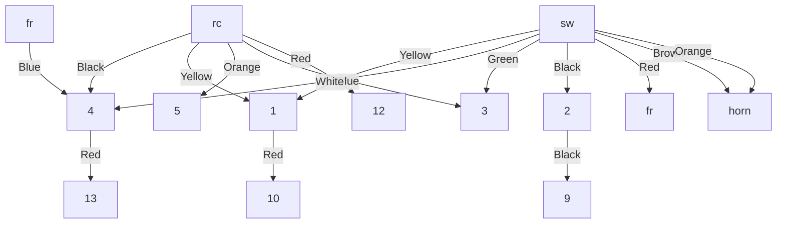

```mermaid  
graph TD  
    rc1[rc] -- Black --> node4[4]  
    rc1 -- Yellow --> node1[1]  
    rc1 -- Orange --> node5[5]  
    rc1 -- Blue --> node3[3]  
    rc1 -- Red --> node12[12]  
    sw1[sw] -- Yellow --> node1  
    sw1 -- White --> node4  
    sw1 -- Green --> node3  
    sw1 -- Black --> node2[2]  
    sw1 -- Red --> node_fr[fr]  
    fr1[fr] -- Blue --> node4  
    sw1 -- Brown --> node_horn[horn]  
    sw1 -- Orange --> node_horn  
    node1 -- Red --> node10[10]  
    node2 -- Black --> node9[9]  
    node4 -- Red --> node13[13]  
```  