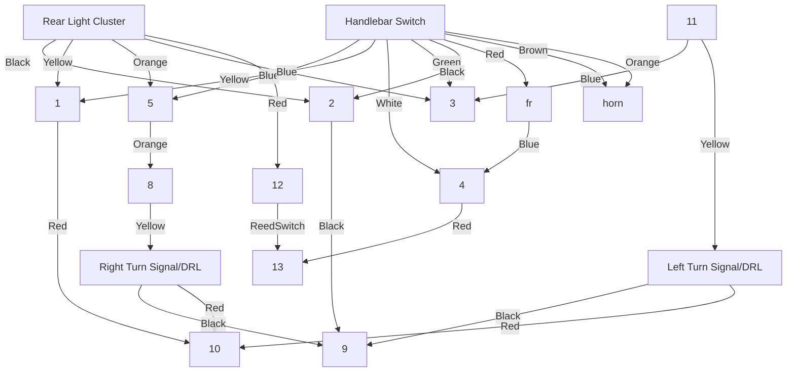

```mermaid  
graph TD  
    rc1[Rear Light Cluster] -- Black --> node2[2 - Negative Block]
    rc1 -- Yellow --> node1[1]  
    rc1 -- Orange --> node5[5]
    node5[5] -- Orange --> node8[8]
    sw1 -- Blue --> node5[5]  
    rc1 -- Blue --> node3[3]
    node11[11] -- Blue --> node3[3] 
    rc1 -- Red --> node12[12]
    
    node11 -- Yellow --> lts[Left Turn Signal/DRL]
    rts -- Black --> node9
    lts -- Black --> node9
    rts -- Red --> node10
    lts -- Red --> node10
    sw1[Handlebar Switch] -- Yellow --> node1  
    sw1 -- White --> node4[4] 
    sw1 -- Green --> node3  
    sw1 -- Black --> node2[2]  
    sw1 -- Red --> fr[fr]  
    fr[fr] -- Blue --> node4  
    sw1 -- Brown --> node_horn[horn]  
    sw1 -- Orange --> node_horn  
    node1 -- Red --> node10[10]  
    node2 -- Black --> node9[9]  
    node4 -- Red --> node13[13]
    node8[8] -- Yellow --> rts[Right Turn Signal/DRL]
    node12 -- ReedSwitch --> node13
```  
