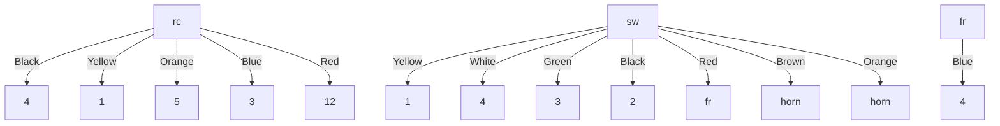

```mermaid  
graph TD  
    rc1[rc] -- Black --> rc4[4]  
    rc1 -- Yellow --> rc1_1[1]  
    rc1 -- Orange --> rc5[5]  
    rc1 -- Blue --> rc3[3]  
    rc1 -- Red --> rc12[12]  
    sw1[sw] -- Yellow --> sw1_1[1]  
    sw1 -- White --> sw4[4]  
    sw1 -- Green --> sw3[3]  
    sw1 -- Black --> sw2[2]  
    sw1 -- Red --> sw_fr[fr]  
    fr1[fr] -- Blue --> fr4[4]  
    sw1 -- Brown --> sw_horn[horn]  
    sw1 -- Orange --> sw_horn2[horn]  
```  