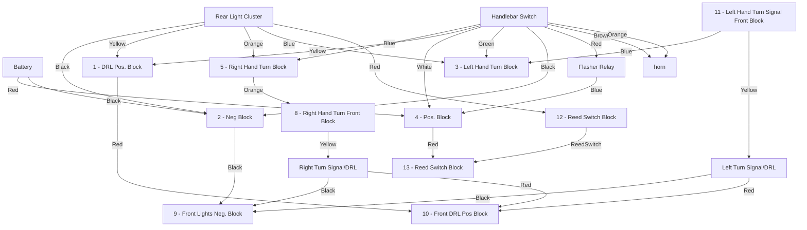

```mermaid  
graph TD
    battery[Battery] -- Red --> node4
    battery -- Black --> node2
    rc1[Rear Light Cluster] -- Black --> node2[2 - Neg Block]
    rc1 -- Yellow --> node1[1 - DRL Pos. Block]  
    rc1 -- Orange --> node5[5 - Right Hand Turn Block]
    node5 -- Orange --> node8[8 - Right Hand Turn Front Block]
    sw1 -- Blue --> node5  
    rc1 -- Blue --> node3[3]
    node11[11 - Left Hand Turn Signal Front Block] -- Blue --> node3[3 - Left Hand Turn Block] 
    rc1 -- Red --> node12[12 - Reed Switch Block]
    
    node11 -- Yellow --> lts[Left Turn Signal/DRL]
    rts -- Black --> node9
    lts -- Black --> node9
    rts -- Red --> node10
    lts -- Red --> node10
    sw1[Handlebar Switch] -- Yellow --> node1  
    sw1 -- White --> node4[4 - Pos. Block] 
    sw1 -- Green --> node3  
    sw1 -- Black --> node2  
    sw1 -- Red --> fr[Flasher Relay]  
    fr -- Blue --> node4  
    sw1 -- Brown --> node_horn[horn]  
    sw1 -- Orange --> node_horn  
    node1 -- Red --> node10[10 - Front DRL Pos Block]  
    node2 -- Black --> node9[9 - Front Lights Neg. Block]  
    node4 -- Red --> node13[13 - Reed Switch Block]
    node8 -- Yellow --> rts[Right Turn Signal/DRL]
    node12 -- ReedSwitch --> node13
```  
