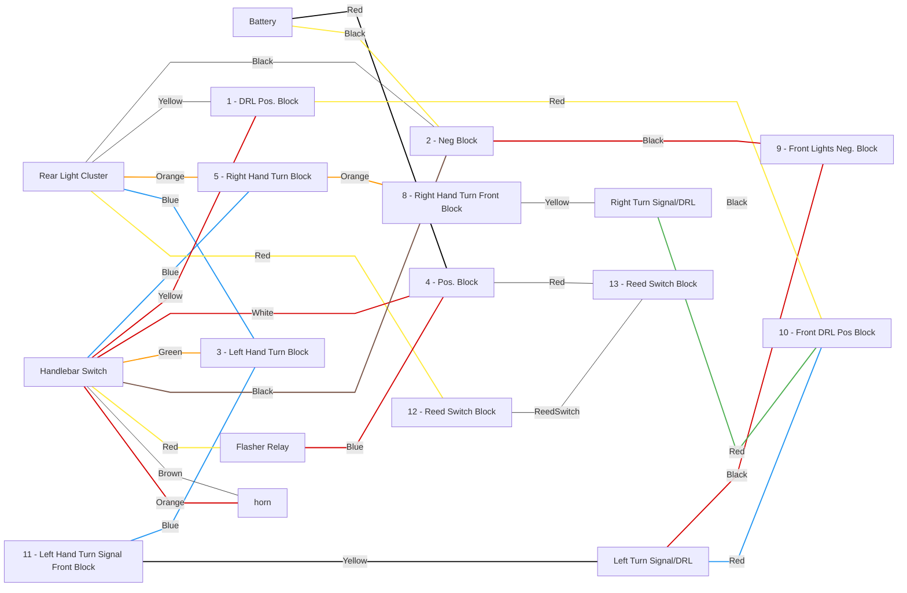

```mermaid
%%{init: {'flowchart' : {'curve' : 'linear'}}}%%
 
flowchart LR  
    battery[Battery] -- Red --- node4  
    battery -- Black --- node2  
    rc1[Rear Light Cluster] -- Black --- node2[2 - Neg Block]  
    rc1 -- Yellow --- node1[1 - DRL Pos. Block]    
    rc1 -- Orange --- node5[5 - Right Hand Turn Block]  
    node5 -- Orange --- node8[8 - Right Hand Turn Front Block]  
    sw1 -- Blue --- node5    
    rc1 -- Blue --- node3[3]  
    node11[11 - Left Hand Turn Signal Front Block] -- Blue --- node3[3 - Left Hand Turn Block]   
    rc1 -- Red --- node12[12 - Reed Switch Block]  
      
    node11 -- Yellow --- lts[Left Turn Signal/DRL]  
    rts -- Black --- node9  
    lts -- Black --- node9  
    rts -- Red --- node10  
    lts -- Red --- node10  
    sw1[Handlebar Switch] -- Yellow --- node1    
    sw1 -- White --- node4[4 - Pos. Block]   
    sw1 -- Green --- node3    
    sw1 -- Black --- node2    
    sw1 -- Red --- fr[Flasher Relay]    
    fr -- Blue --- node4    
    sw1 -- Brown --- node_horn[horn]    
    sw1 -- Orange --- node_horn    
    node1 -- Red --- node10[10 - Front DRL Pos Block]    
    node2 -- Black --- node9[9 - Front Lights Neg. Block]    
    node4 -- Red --- node13[13 - Reed Switch Block]  
    node8 -- Yellow --- rts[Right Turn Signal/DRL]  
    node12 -- ReedSwitch --- node13  
  
%% Link Styles  
%% Black  
linkStyle 0 stroke:#000000,stroke-width:2px  
linkStyle 1 stroke:#000000,stroke-width:2px  
linkStyle 10 stroke:#000000,stroke-width:2px  
  
%% Red  
linkStyle 12 stroke:#D50000,stroke-width:2px  
linkStyle 15 stroke:#D50000,stroke-width:2px  
linkStyle 16 stroke:#D50000,stroke-width:2px  
linkStyle 20 stroke:#D50000,stroke-width:2px  
linkStyle 22 stroke:#D50000,stroke-width:2px  
linkStyle 24 stroke:#D50000,stroke-width:2px  
  
%% Yellow  
linkStyle 1 stroke:#FFEB3B,stroke-width:2px  
linkStyle 9 stroke:#FFEB3B,stroke-width:2px  
linkStyle 19 stroke:#FFEB3B,stroke-width:2px  
linkStyle 23 stroke:#FFEB3B,stroke-width:2px  
  
%% Orange  
linkStyle 4 stroke:#FF9800,stroke-width:2px  
linkStyle 5 stroke:#FF9800,stroke-width:2px  
linkStyle 17 stroke:#FF9800,stroke-width:2px  
  
%% Blue  
linkStyle 6 stroke:#2196F3,stroke-width:2px  
linkStyle 7 stroke:#2196F3,stroke-width:2px  
linkStyle 8 stroke:#2196F3,stroke-width:2px  
linkStyle 14 stroke:#2196F3,stroke-width:2px  
  
%% Green  
linkStyle 13 stroke:#4CAF50,stroke-width:2px  
  
%% Brown  
linkStyle 18 stroke:#795548,stroke-width:2px  
  
%% White  
linkStyle 11 stroke:#FFFFFF,stroke-width:2px  
```  
